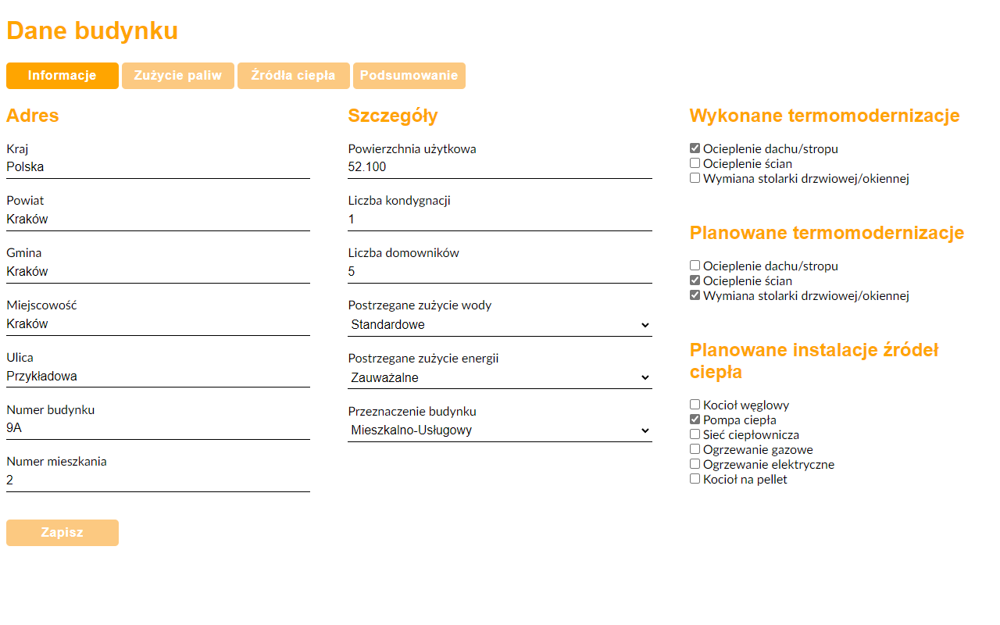
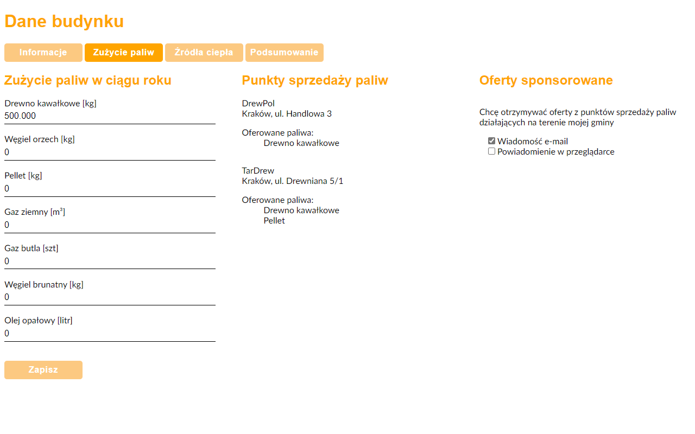
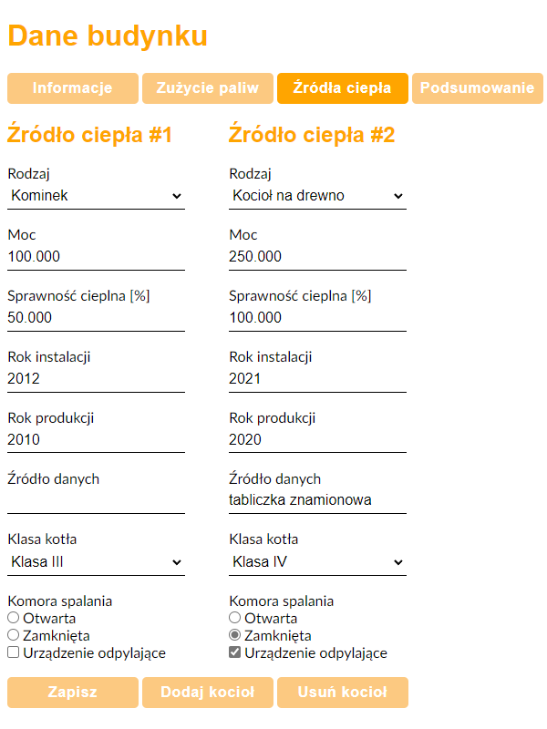
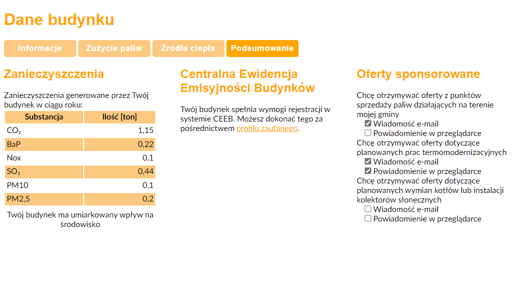

# thermo-assistant

Jest to aplikacja, która ułatwi Ci przeprowadzenie termomodernizacji Twojego budynku i znajdzie punkty sprzedaży paliw w Twojej okolicy.
Pozwoli obliczyć zanieczyszczenia generowane przez Twój budynek i sprawdzi, czy masz obowiązek rejestracji zainstalowanych źródeł ciepła w systemie CEEB.
Asystent może także powiadamiać na bieżąco o aktualnych ofertach u dystrybutorów paliw lub agentów zajmujących się termomodernizacjami.

## Przykład działania
Aplikacja udostępnia formularze, w których można podać najważniejsze dane o Twoim budynku:

Na podstawie wskazanego adresu, aplikacja wygeneruje listę punktów sprzedaży paliw w Twojej gminie. Pozwoli także na otrzymywanie powiadomień o ofertach.

Do budynku można dodać wiele źródeł ciepła:

Ostatecznie, aplikacja obliczy zanieczyszczenia i pokaże podsumowanie:

### Wykorzystane technologie
- PHP 7.4
- CSS 3
- HTML 5
- JavaScript
- PostgreSQL
